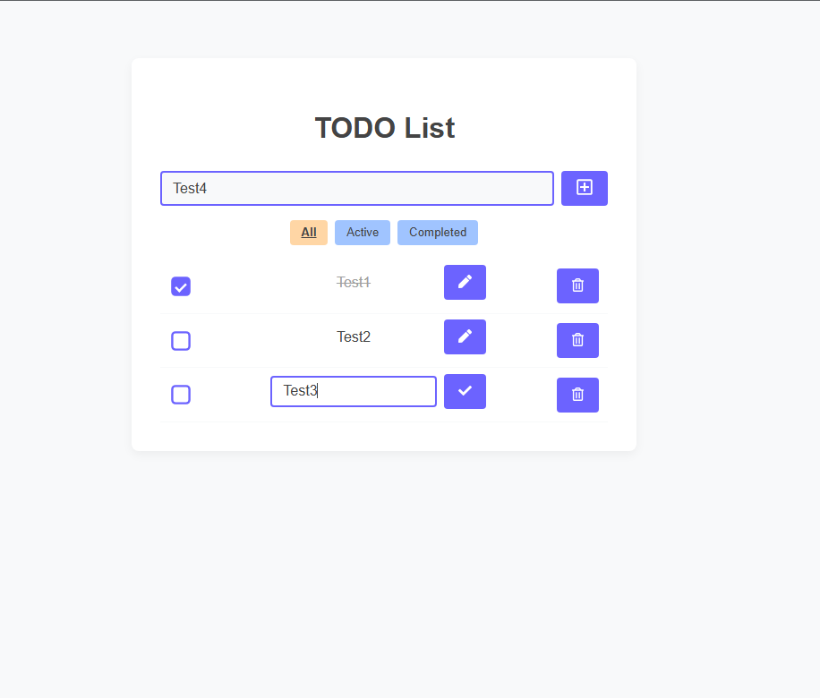

# To-Do List App

This is a simple To-Do List application built with React 19 and vanilla CSS, compiled using Vite.



## 🚀 Setup & Run

### **Prerequisites**

- NodeJS (v22)
- npm (v11)

### Live Deployment

The app is deployed on Vercel and can be accessed here:

```
span
```

### **Running Locally**

1. **Clone the repository**

   ```
   git clone https://github.com/your-username/todo-list-app.git
   cd todo-list-app
   ```

2. **Install dependencies**

   ```
   npm install
   ```

3. **Start the dev server**

   ```
   npm run dev
   ```

   - App will open at: `http://localhost:5173`

## Notes & Assumptions

### **Key Features**

- **Add/Delete Tasks** : Simple CRUD operations with animations.
- **Filtering** : Toggle between "All," "Active," and "Completed" tasks.
- **Persistence** : To-Do items are saved to `localStorage`.

### **Technical Choices**

- **TypeScript** : Strict typing for safer state management.
- **Vite** : Faster builds and HMR compared to Create React App.
- **Vanilla CSS** : No CSS frameworks to keep dependencies minimal.

### **Assumptions**

1. Tasks are user-specific (no backend/auth).
2. Mobile responsiveness was prioritized
